# iOS Workflows
A collection of workflows for [Workflow App](https://workflow.is).

## MTL Cab Fare Calculator
### Description
I’m bad at working out quickly how much to tip a cab driver in my head, and just as bad at working how much to ask for in change if I give them the fare in dollar notes.

This workflow provides a Today widget will calculate the tip for you, telling you how much to give the driver in $10 increments and how much to ask back for in change.

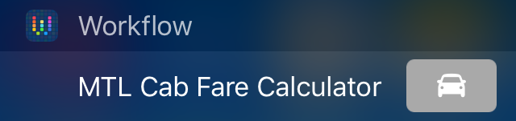

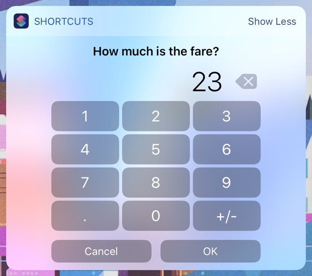

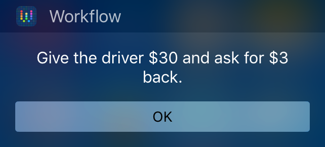

### Installation
You can install the workflow directly from [this link](https://workflow.is/workflows/b40461d51f4a48a0a643289564f0dc86), or download it as a `.wflow` file from this repository instead.

## Guess the Number
### Description
A simple game for your Today widget. Try and guess the secret number in under 10 tries!

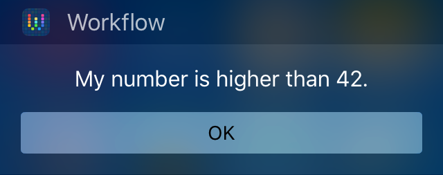
### Installation
You can install the workflow directly from [this link](https://workflow.is/workflows/20037c586a5e44cc97b94d6b9e560e22), or download it as a `.wflow` file from this repository instead.

## Stache
### Description
For some reason, [Stache](http://getstache.com) doesn't provide access via the iOS share sheet when using Chrome. This workflow provides the missing functionality. To use choose "Share" in Chrome, then "Run Workflow" from the share sheet and finally "Stache".

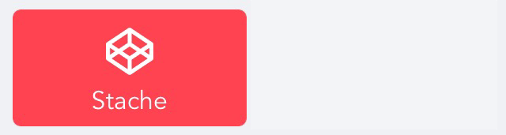

### Installation
You can install the workflow directly from [this link](https://workflow.is/workflows/52267a774ccd46949db187bb53f52aac), or download it as a `.wflow` file from this repository instead.

## Toggle Gamma
### Description
A simple workflow to toggle [GammaThingy](https://github.com/thomasfinch/GammaThingy) on and off. Add it to your homescreen or Today Widget, and the workflow will return you home after performing the toggle.

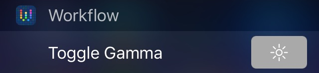

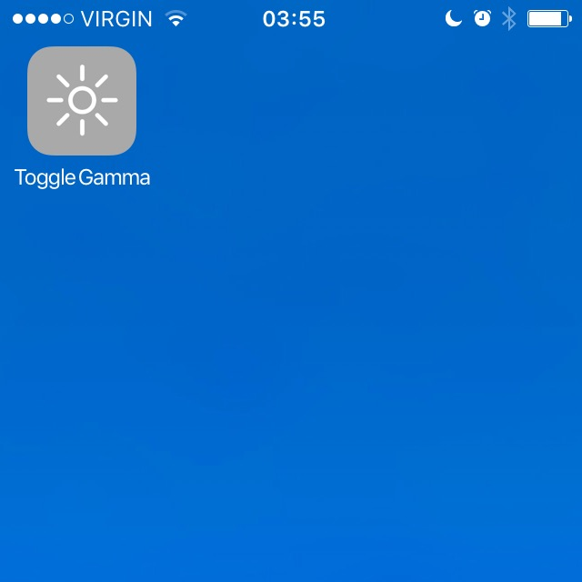

### Installation
You can install the workflow directly from [this link](https://workflow.is/workflows/dd0d7648bdcc403284211ca31de7e848), or download it as a `.wflow` file from this repository instead.

## Battery Level
### Description
A simple workflow for your Today Widget which shows the current battery percentage. Clicking "OK" will take you to the battery settings page. Useful for when you're not showing that information in the status bar, or when you quickly want to enable low power mode.

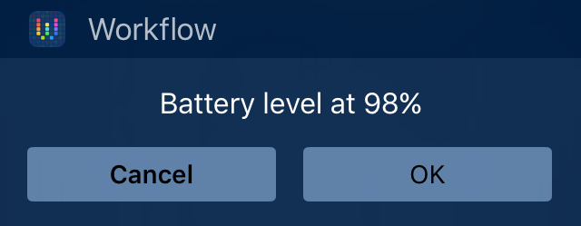

### Installation
You can install the workflow directly from [this link](https://workflow.is/workflows/241944156d0f4c8baae93a639fdab06f), or download it as a `.wflow` file from this repository instead.

## MTL Metro Status
### Description
MTL Metro Status provides realtime updates on the status of the Montréal Metro direct from [metroapp.heliomass.com](http://metroapp.heliomass.com) to your Today widget, or on your homescreen as an alternative to the webapp.

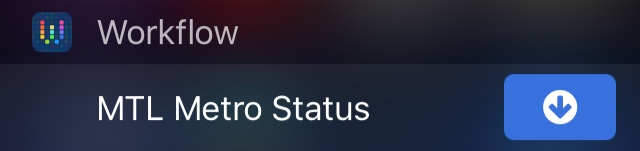

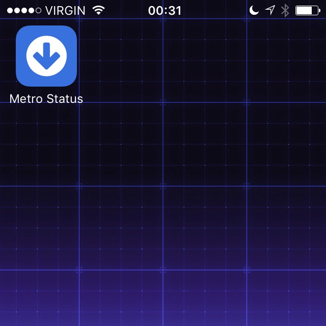

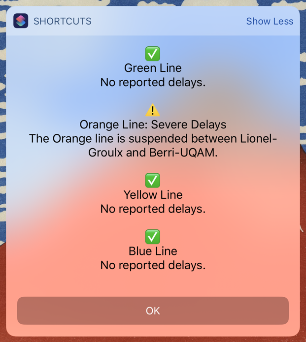

### Installation
You can install the workflow by downloading the `.wflow` file directly from this repository.

### Issues
I have chosen not to add this workflow to the official gallery at this time, due to a severe bug with the current version of Workflow (v1.4.1).

When the Metro status contains too much content, the Today widget will freeze, and the only workaround right now is to restart the phone.

The Workflow development team have been informed of the issue, and given the severity of the bug we can but hope it will be addressed in their next release.

## Image to Desktop
### Description
Sometimes you just want to send a file or an image from your iOS device and have it appear directly on your Mac's desktop, without having to load up the DropBox app and then locate it on your Mac after the upload.

This workflow combines with [Hazel](https://www.noodlesoft.com/hazel.php) using [DropBox](https://www.dropbox.com) as a pipe between the two. You simply select the workflow from the share sheet, and your chosen file or image will appear on your desktop moments later.

### Installation
Add `Image to Desktop.wflow` from this repository to your Workflow app. The workflow when run will create a new directory at `Dropbox/Photos/Sent iOS`.

Then, install the Hazel rules from `Sent iOS.hazelrules` and apply them to the aforementioned directory.

## Flashy Screen
This deeply irresponsible workflow will make your screen flash at high speed along with the backlight. I can't actually think of a sensible use case for this.

__*WARNING: Please don't run this workflow if you suffer from seizures triggered by flashing lights.*__

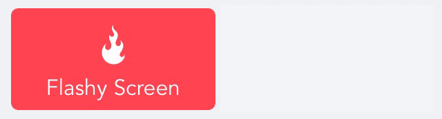

### Installation
You can install the workflow by downloading the `.wflow` file directly from this repository.

## Post Later
### Description
Ever "needed" to update Facebook or Twitter when you're outside of mobile phone coverage, for example on the Metro? Worried you'll forget to post your groundbreaking update before your phone gets a signal?

Fear not, this workflow will let you make your update, then keep running in the background until that all important signal returns, at which point it will post the update and alert you with a notification.

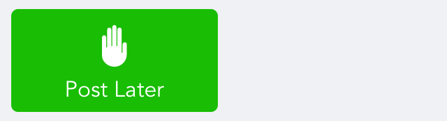

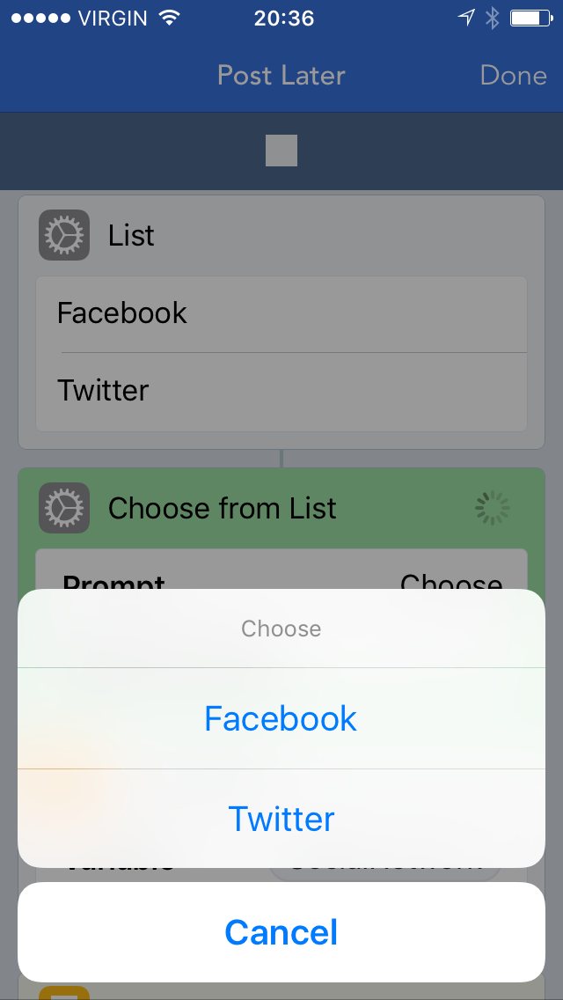

### Installation
You can install the workflow from this repository by [clicking here](https://github.com/heliomass/iOSWorkflows/blob/master/Post%20Later.wflow).

### Known Issues
This workflow is somewhat experimental, and as such you shouldn't rely on it working perfectly. Known problems include:

* The notification can fail to be sent due to a bug in the Workflow app that can cause notifications to bottleneck the workflow. Usually the update has been posted by this point.
* Sometimes there's enough signal for the workflow to try and make the update, but not enough for the update to succeed. In these cases, the workflow will fail silently and you will see an error to this effect when you next open the app.

## Import to Pythonista
### Description
A Workflow allowing you to easily import Python scripts into [Pythonista](http://omz-software.com/pythonista/). You can either invoke it via the share sheet, or run the workflow from the app and manually enter a URL.

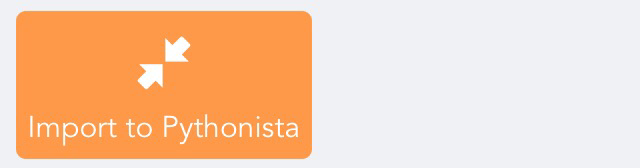

### Installation
Install `Import to Pythonista.wflow` from this repository as normal.

As a one-off, you'll need to manually import the Python script. Open `ImportViaWorkflow.py` from this repository and copy / paste the script into Pythonista, ensuring that the name of the script matches `ImportViaWorkflow.py`.

## Next Appointment
### Description
A workflow to take you to your next appointment with [Transit App](http://transitapp.com).

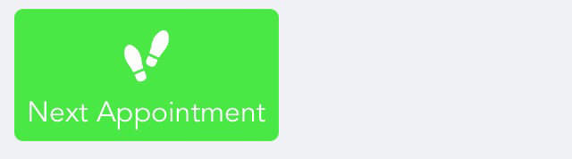

### Installation
You can install the workflow by downloading the `.wflow` file directly from this repository.

## Tweet Splitter
### Description
Do you get annoyed with Twitter's 140 character limit? This Workflow will integrate with [Pythonista](http://omz-software.com/pythonista/) to split your oversized tweet over two or more smaller tweets.

### Installation
Make use of the Import to Pythonista workflow above to import `TweetSplitter.py` into Pythonista, and then install the `Tweet Splitter.wflow` workflow as usual.

## Network Info
### Description
A workflow to show you what your IP addresses are, as well as your carrier and WiFi network name.

### Installation
You can install the workflow by downloading the `.wflow` file directly from this repository.

## Phone Loved One
### Description
Quickly phone your loved one from the Workflow Today widget.

If you're on WiFi, the workflow will attempt to call using FaceTime Audio, otherwise it will make a regular phone call.

## Installation
You can install the workflow by downloading the `.wflow` file directly from this repository.

Once installed, you'll need to open the workflow and add your loved one as a contact via the instructions you'll see.

## Nearest Bixi Dock
### Description
Locates the nearest [Bixi](http://bixi.com) dock in your Today Widget, and tells you how many bikes and free docks are available. Optionally, it will also provide walking or cycling directions.

I created this because sometimes you know the area and just want to see at a glance which cross-street the nearest station is at, and whether you could dock your bike there.

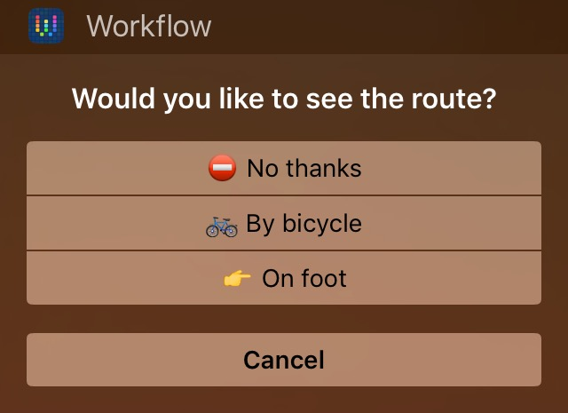

This widget is powered by [Bixi Time](http://bixitime.com). You can get the source code for Bixi Time [here](https://github.com/euoia/bixitime-website).

### Installation
You can install the workflow by downloading the `.wflow` file directly from this repository.

Maps default to Google Maps to display the route to the nearest dock, but you can change the app in the workflow itself towards the bottom.