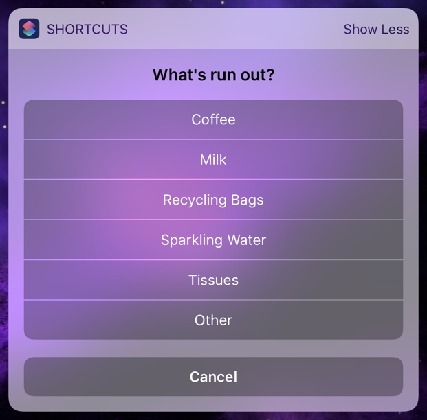
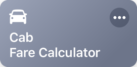
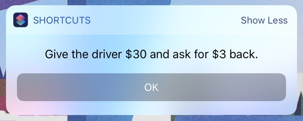
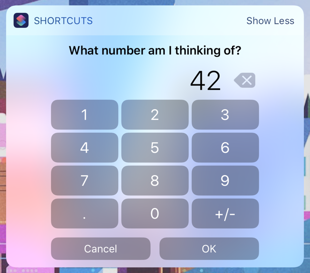
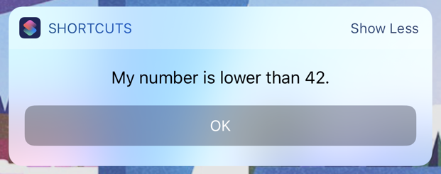

# iOS Shortcuts
A collection of shortcuts for the [Shortcuts app](https://support.apple.com/en-ca/HT208309).

_(To view the original collection of Workflows for iOS 11 and earlier using Workflow App, [click here](https://github.com/heliomass/iOSWorkflows/tree/v1).)_

## Table of Contents

* [Replenish](#-replenish)
* [Cab Fare Calculator](#-cab-fare-calculator)
* [Office Bucket](#-office-bucket)
* [Do Not Disturb](#-do-not-disturb)
* [Down for Everyone?](#-down-for-everyone)
* [Brew Tea](#-brew-tea)
* [Search](#-search)
* [Emoji Lookup](#-emoji-lookup)
* [Mobile Kanban](#-mobile-kanban)
* [Budget](#-budget)
* [Learn New Word](#-learn-new-word)
* [Review Word](#-review-word)
* [Guess the Number](#-guess-the-number)
* [Functions](#-functions)
    * [Input Filter](#input-filter)
    * [Filter Shortcuts and Run](#filter-shortcuts-and-run)
    * [First Day of Week](#first-day-of-week)
    * [Fire IFTTT Webhook](#fire-ifttt-webhook)

##  Replenish
### Description
This Shortcut helps you and your family to manage replacing essential items around the house. For example, if you run out of coffee, run the shortcut, simply select "Coffee" and let the rest of the magic happen:

* The item will be added to a shared Reminders list.
* You'll get an alert when you're nearby the designated shop for that item.
* A text will be sent to chosen people to let them know the item has run out.

### Installation
Installation and setup requires a few separate steps to complete, but once done you won't need to make any changes except to add or remove items.
    
1. **Configure the list of Items and Locations**

    The Shortcut consults a JSON file of these items. Named `replenish_items.json`, it lives in the Shortcuts folder of your iCloud drive.
    
    To stare you off, there's an example file [here](examples/replenish_items.json), but obviously you'll want to adjust it to your own needs. The easiest way to do this is using a text editor, but there are also iOS specific apps for editing JSON such as [Jayson](https://itunes.apple.com/ca/app/jayson/id1447750768?mt=8) if you don't have a Mac or Windows machine to use.
    
    There are two main sections to the JSON file:
    
    * **Locations**
    
        This section lists locations you want to be reminded to buy something at. For example, `"My Grocery Store": "4516  Dundas St, London, ON, N6B 3L5"`. What's key is that the address would be a valid one in an Apple Maps search.
    
    * **Items**

        Here's where you keep your list of things to replenish, complete with a signifying emoji! Each item is linked back to one of the locations you listed above. For example:
        
            "Coffee": {
                "item": "Coffee",
                "location": "My Grocery Store",
                "emoji": "☕️"
            }

    It's as simple as that!
    
2. **Sharing the Item List**

    If you're sharing between multiple household members, place `replenish_items.json` in your iCloud "Shortcuts" folder and share this file with anyone you need to. Ensure others have the file in the same location as you do. This way, when you edit the contents, the changes will be shared with everyone.
    
3. **Download and Configure the Shortcut**

    **_Click [here](https://www.icloud.com/shortcuts/cee9e7442272427ca01ea46de4e87499) to install_**.
    
    When you run it for the first time, you'll be asked for the following information:
    
    * The location of `replenish_items.json`
    * An optional list of contacts to send a text to each time an item needs to be replenished (don't include yourself in the list)
    * The Reminders list to use

    Anyone else installing this Shortcut will need to go through the same questions.
    
    This Shortcut is best run from the widget and does not require the phone to be unlocked.

##  Cab Fare Calculator

### Description
I’m bad at working out quickly how much to tip a cab driver in my head, and just as bad at working how much to ask for in change if I give them the fare in dollar notes.

This Shortcut provides a Today widget to calculate the tip for you, telling you how much to give the driver in $10 increments and how much to ask back for in change.

### Installation
**_Click [here](https://www.icloud.com/shortcuts/1b4cc3bfd96b42cbb5a538c286b077da) to install._**

##  Office Bucket

### Description
This is for when you remember something you need to do at the office, but you're not at the office. Run this Shortcut and it will be added to a Reminders list. Then, you can forget about the task until you arrive at the office. The reminder item is tied to your office location, so you'll get a friendly reminder on arrival at your desk.

### Installation
**_Click [here](https://www.icloud.com/shortcuts/dda350109be647529bcbc23628c32613) to install._**

##  Do Not Disturb

### Description
Provides more granular control over Do Not Disturb (DND) from the widget. Whereas Control Center lets you set DND for one hour, this Shortcut will let you activate DND until a specific time.

### Installation
**_Click [here](https://www.icloud.com/shortcuts/5ea2bf50a6524d06bc622788b49d1ed1) to install._**

##  Down for Everyone?
### Description
Consults [downforeveryoneorjustme.com](https://downforeveryoneorjustme.com) to tell you the status of the current web page. Call it up from the iOS share sheet in your favourite browser when a website won't load, and it'll tell you if the site is down or not.

### Installation
**_Click [here](https://www.icloud.com/shortcuts/3d7ed0c154c54b02beeab3a32215777f) to install._**

##  Brew Tea

### Description
Sets a tea timer. Very important.

On first run, it'll ask you how many minutes you prefer your tea to be brewed, as well as which Reminders list to use. After that, you can launch it from the widget whenever you need it.

### Installation
**_Click [here](https://www.icloud.com/shortcuts/1a66760e59034d3bb18970ea4225da50) to install._**

##  Search
### Description
Simply searches Google. Run the shortcut directly to be prompted. Use the shortcut in the Share Sheet with highlighted text to search from anywhere.

### Installation & Dependencies
**_Click [here](shortcuts/Search.shortcut) to install._**

⚠️ **_You will need the [Input Filter](#input-filter) function installed._**

##  Emoji Lookup
### Description
Will let you search [Emojipedia](https://emojipedia.org). You can call it directly and enter a search term, or use it from the share sheet with highlighted text.

I created this as I find the built in iOS emoji keyboard inefficient, particularly if I'm looking for emoji ideas rather than a specific emoji.

### Installation & Dependencies
**_Click [here](Emoji%20Lookup.shortcut) to install._**

⚠️ **_You will need the [Input Filter](#input-filter) function installed._**

##  Mobile Kanban
### Description
If you have a physical [Kanban](https://en.wikipedia.org/wiki/Kanban) at home or at work, you might want to refer to it on the move. This Shortcut lets you quickly snap a photo of it, for example when leaving the office. You can then quickly recall the photo on the move.

The Shortcut provides an option to either take "View" or "Record" the Kanban. Choose "Record" to take a fresh photo which will overwrite the existing one.

### Installation
**_Click [here](https://www.icloud.com/shortcuts/1df3ace417c943d0b83a965d51a329e6) to install._**

##  Budget
### Description
I give myself a weekly budget to limit how much I spend on snacks and coffee during the working week. This Shortcut helps you track how your budget is doing during the week. Every time you make a purchase, simply run the shortcut from your widget and enter the amount you spent. A notification will let you know how much budget you have left for the week, and how close you are to going in the red.

### Installation
On installation, you'll be prompted to enter your budget for the week.

**_Click [here](https://www.icloud.com/shortcuts/74264e440ce142eda500c611b7e5e120) to install._**

⚠️ **_You will need the [First Day of Week](#first-day-of-week) function installed._**

##  Learn New Word
### Description
Every come across a new word you had to look up, and wanted to retain its meaning? This Shortcut will help. There are two ways to run it:

* Launch the Shortcut directly and enter the word directly. You'll be show its definition, and the prompted as to whether you want to store the word or not.
* Highlight the word and call this Shortcut from the sharesheet.

Use this Shortcut with "Review Word".

### Installation
**_Click [here](https://www.icloud.com/shortcuts/c929ad694b404f5a80c96a12caed049e) to install._**

##  Review Word
### Description
The companion Shortcut to "Learn New Word". When you run it, a word will be picked at random and you'll be prompted to recall its definition. Click "OK" to see the word's definition and find out if you were right!

### Installation
**_Click [here](https://www.icloud.com/shortcuts/633bd7e2ac9f48deb41d63e62aa4222a) to install._**

##  Guess the Number
### Description
A simple game for your Today widget. Try and guess the secret number in under 10 tries!

### Installation
**_Click [here](https://www.icloud.com/shortcuts/bdb916906cfd40c5bf9d409006b8274f) to install._**

##  Functions
Functions are Shortcuts which get called from other Shortcuts. They provide reusable functionality for common tasks. Some of the main Shortcuts here may have dependencies on these.

### Input Filter
Prompts the user for input if your shortcut's input is empty.

You'd use this if you have a Shortcut which can be used on its own, but also from the Share Sheet. In the former case, you'd want to prompt the user for input. In the latter case, the input would be retrieved via the Share Sheet.

To use, create a dictionary with the following two keys and pass it to the Input Filter workflow:

* `Data` - The Shortcut Input
* `Prompt` - A prompt for the user if Shortcut Input was empty

The user will then be prompted to fill out the missing information in the case the Shortcut Input was empty.

**_Click [here](functions/Input%20Filter.shortcut) to install._**

### Filter Shortcuts and Run
Provided a list of Shortcut names (as strings), the user will be prompted to select a workflow to run. You can use this to create drill-downs and sub-menus to better organise your shortcuts.

**_Click [here](functions/Filter%20Shortcuts%20and%20Run.shortcut) to install._**

⚠️ _If you have many Shortcuts installed, running this shortcut will cause the Shortcuts app's Today widget to crash. This is a limitation of iOS which restricts the amount of memory a widget has available. I hope iOS 13 will fix this, but in the interim if you're affected, you may want to utilise the "Continue Shortcut in App" action just before calling this shortcut._

### First Day of Week
Call this Shortcut to get the date of the first day of the current week. For example, if today is Wednesday 3rd January, the Shortcut would return 1st January for the Monday.

On installation, you'll be prompted to choose Sunday or Monday as your first day of the week.

**_Click [here](functions/First%20Day%20of%20Week.shortcut) to install._**

### Fire IFTTT Webhook
Back in the days of Workflow, there was a built-in action to trigger an [IFTTT](https://ifttt.com) "applet", but this was removed when Apple bought Workflow and renamed it Shortcuts.

My personal approach to preserving IFTTT interactions was to use IFTTT's [webhook](https://ifttt.com/maker_webhooks) feature. And in order to make things more streamlined, I created a dedicated shortcut to easily call webhooks.

When you install the shortcut, you'll be prompted for your personal API key. If you don't have one already, you'll need to generate one on the IFTTT website.

When calling the shortcut, provide a dictionary with the following items:

* `WebhookName` - The name of your webhook on IFTTT
* `Value1` - The first item to pass into your webook (optional)
* `Value2` - The second item to pass into your webook (optional)
* `Value3` - The third item to pass into your webook (optional)

Note that _all four_ items in the dictionary need to be present, even if the "Value" items are empty. You then call the _Fire IFTTT Webook_ with "Run Shortcut" immediately after defining the above dictionary.

Anything returned by IFTTT can be captured after calling the shortcut.

**_Click [here](functions/Fire%20IFTTT%20Webhook.shortcut) to install._**
