# iOS Workflows
A collection of workflows for [Workflow App](https://workflow.is).

## MTL Cab Fare Calculator
### Description
I’m bad at working out quickly how much to tip a cab driver in my head, and just as bad at working how much to ask for in change if I give them the fare in dollar notes.

This workflow provides a Today widget will calculate the tip for you, telling you how much to give the driver in $10 increments and how much to ask back for in change.

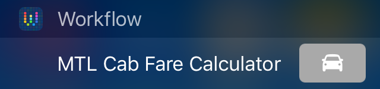

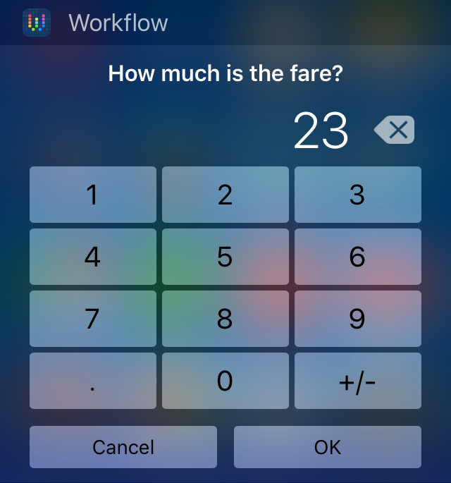

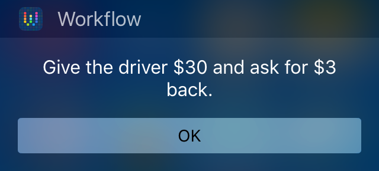

### Installation
You can install the workflow directly from [this link](https://workflow.is/workflows/b40461d51f4a48a0a643289564f0dc86), or download it as a `.wflow` file from this repository instead.

## Guess the Number
### Description
A simple game for your Today widget. Try and guess the secret number in under 10 tries!

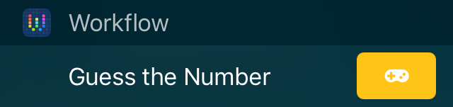

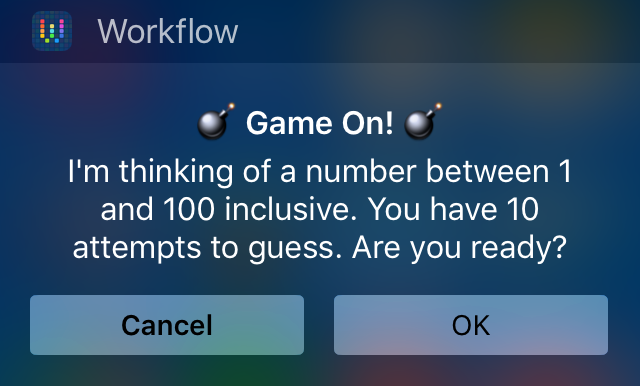

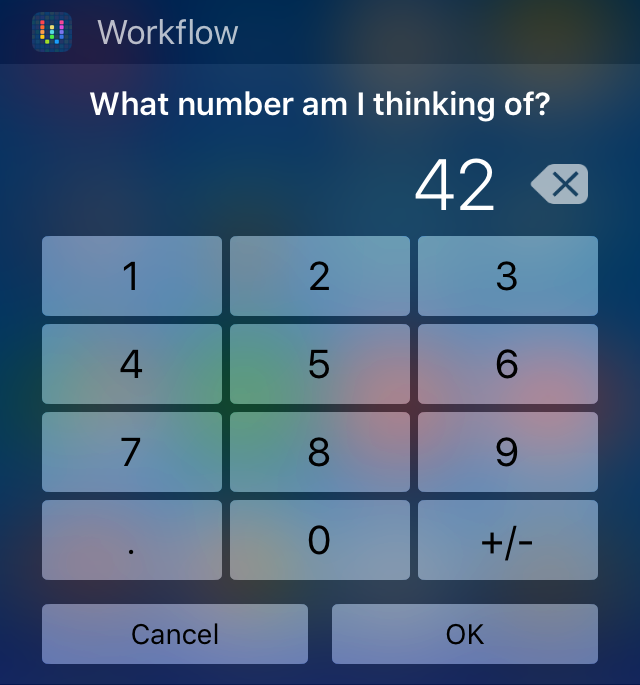

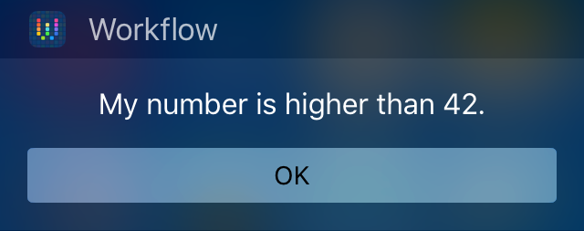
### Installation
You can install the workflow directly from [this link](https://workflow.is/workflows/20037c586a5e44cc97b94d6b9e560e22), or download it as a `.wflow` file from this repository instead.

## Stache
### Description
For some reason, [Stache](http://getstache.com) doesn't provide access via the iOS share sheet when using Chrome. This workflow provides the missing functionality. To use choose "Share" in Chrome, then "Run Workflow" from the share sheet and finally "Stache".

### Installation
You can install the workflow directly from [this link](https://workflow.is/workflows/52267a774ccd46949db187bb53f52aac), or download it as a `.wflow` file from this repository instead.

## Toggle Gamma
### Description
A simple workflow to toggle [GammaThingy](https://github.com/thomasfinch/GammaThingy) on and off. Add it to your homescreen or Today Widget, and the workflow will return you home after performing the toggle.

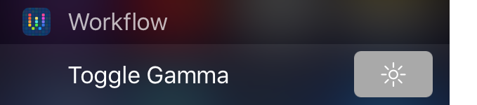

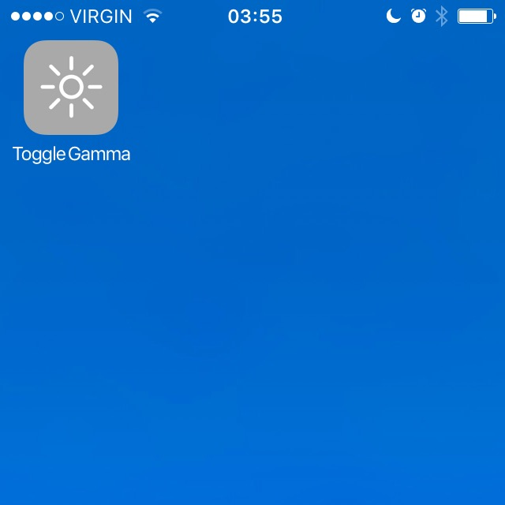

### Installation
You can install the workflow directly from [this link](https://workflow.is/workflows/dd0d7648bdcc403284211ca31de7e848), or download it as a `.wflow` file from this repository instead.

## Battery Level
### Description
A simple workflow for your Today Widget which shows the current battery percentage. Useful for when you're not showing that information in the status bar.

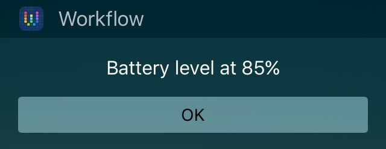

### Installation
You can install the workflow directly from [this link](https://workflow.is/workflows/241944156d0f4c8baae93a639fdab06f), or download it as a `.wflow` file from this repository instead.

## MTL Metro Status
### Description
MTL Metro Status provides realtime updates on the status of the Montréal Metro direct from [metroapp.heliomass.com](http://metroapp.heliomass.com) to your Today widget, or on your homescreen as an alternative to the webapp.

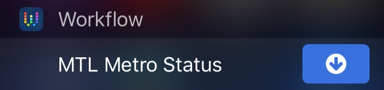

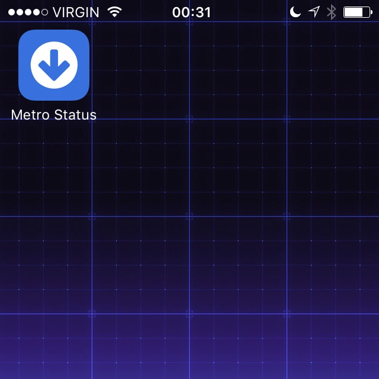

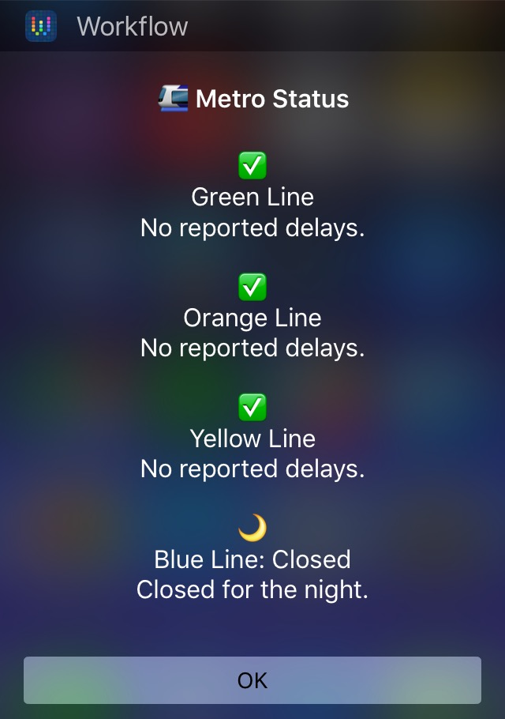

### Installation
You can install the workflow by downloading the `.wflow` file directly from this repository.

### Issues
I have chosen not to add this workflow to the official gallery at this time, due to a severe bug with the current version of Workflow (v1.4.1).

When the Metro status contains too much content, the Today widget will freeze, and the only workaround right now is to restart the phone.

The Workflow development team have been informed of the issue, and given the severity of the bug we can but hope it will be addressed in their next release.